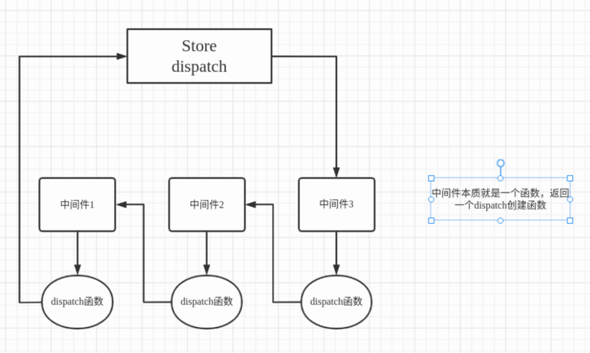

# 项目介绍

    - 主要就是了解redux中间件的源码，写一个简易版本
        1. createStore(reducer, applyMiddleware?: Function, initialvalue?: any) 创建仓库 返回一个对象 包含 subscribe、getState、dispatch等
        2. bindActionCreators(actionCollection: obejct | Function, dispatch: Function): object | Function 就是返回自动分发的函数
        3. combineReducers(reducers: object) 合并多个reducer到最终root reducer中 此时需要对整个进行验证
        4. applyMiddleWare(...middleWares: Function[]) 就是使用中间件 
    - 中间件原理 (**主要就是去修改dispatch函数 因为在这个函数内部 我们可以获取oldState、newState、action**)
        - 原理示意图:
            
        - 细节:
            1. 本质就是一个洋葱模型
            2. 中间件的本质就是修改dispatch函数 因为在当前函数 我们可以拿到oldState、action、newState
            3. 中间件是一个dispatch创建函数
            4. 中间件被传递一个参数 store store就是仓库对象 但是只存在两个属性 getState => 获取状态 dispatch最终存储在仓库中的dispatch函数
            5. dispatch创建函数被传递一个参数 下一个中间件返回的dispatch函数 如果当前中间件是最后一个中间件 此时就是会原本存储在仓库中的dispatch函数
            6. 最终本质就是得到一个dispatch函数 所以此时就是会返回
            7. 并且只有最后的一个中间进行了移交 此时才会使得仓库中的值发生变化

## 下载依赖

***
    yarn 
    npm install
***

## 启动项目

***
    yarn start
    npm start
***
